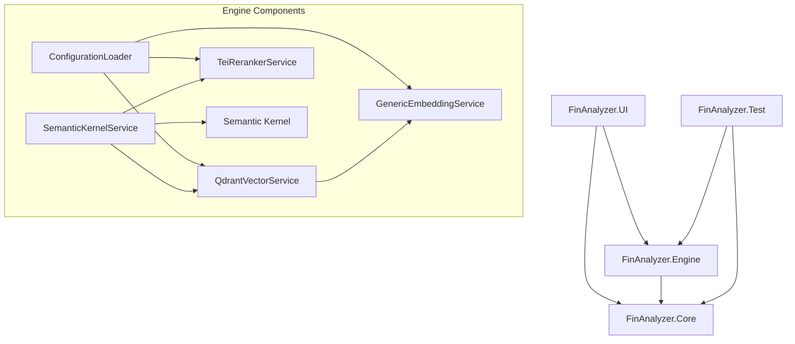

# System Architecture

## 1. Architectural Pattern: Clean Architecture

The solution follows a strict **Clean Architecture** pattern. Dependencies flow **inwards**, meaning the Core (Domain) has no dependencies on external libraries or frameworks.



---

## 2. Project Breakdown

### 🔴 FinAnalyzer.Core (Domain Layer)

**Role:** The "Language" of the application. Contains enterprise-wide contracts and data models.

- **Dependencies:** `None` (Pure .NET Standard/Core).

### 🟡 FinAnalyzer.Engine (Application/Infrastructure Layer)

**Role:** The "Brain" and "Hands". Implements the interfaces defined in Core using specific libraries.

- **Dependencies:** `Microsoft.SemanticKernel`, `Qdrant.Client`, `PdfPig` (Planned), `Microsoft.ML.Tokenizers` (Added).

### 🔵 FinAnalyzer.UI (Presentation Layer)

**Role:** The "Face". A WPF application using MVVM pattern.

- **Dependencies:** `CommunityToolkit.Mvvm`, `Microsoft.Extensions.Hosting`, `System.Linq.Async` (via Transitive Core).

### 🟢 FinAnalyzer.Test (Verification Layer)

**Role:** The "Auditor". Automated tests to verify logic.

- **Dependencies:** `xUnit`, `NSubstitute`, `FluentAssertions`.

---

## 3. File Structure Map (Current & Planned)

This map shows the **Solution Structure**. Items marked with `*` are **Planned for Phase 2**.

```text
FinAnalyzer_Enterprise/
├── directory.build.props           # [ Build ] Common MSBuild settings
├── docker-compose.yml              # [ Infra ] Database & AI Services
├── FinAnalyzer_Enterprise.slnx     # [ Sln ] VS 2026 Solution File
│
├── FinAnalyzer.Core/               # [ Domain ] Pure business logic & contracts
│   ├── FinAnalyzer.Core.csproj
│   ├── Interfaces/
│   │   ├── IEmbeddingService.cs
│   │   ├── IFileLoader.cs
│   │   ├── IModelLifecycle.cs
│   │   ├── IRagService.cs
│   │   ├── IRerankerService.cs
│   │   └── IVectorDbService.cs
│   └── Models/
│       ├── DocumentChunk.cs
│       ├── PageContent.cs
│       └── SearchResult.cs
│
├── FinAnalyzer.Engine/             # [ App Layer ] Implementation of Core interfaces
│   ├── FinAnalyzer.Engine.csproj
│   ├── appsettings.json            # [ Config ] Centralized App Config
│   ├── Configuration/
│   │   └── ConfigurationLoader.cs  # [ Config ] Standardized Config Loading
│   ├── Services/
│   │   ├── GenericEmbeddingService.cs
│   │   ├── PdfPigLoader.cs
│   │   ├── QdrantVectorService.cs
│   │   └── TextChunker.cs
│
├── FinAnalyzer.UI/                 # [ Presentation ] WPF Application
│   ├── FinAnalyzer.UI.csproj
│   ├── MainWindow.xaml             # [ View ] Main Shell
│   └── App.xaml
│
└── FinAnalyzer.Test/               # [ Tests ] Unit & Integration Tests
    ├── FinAnalyzer.Test.csproj
    ├── InfrastructureTests.cs      # [ Verify ] Docker Service Connectivity
    ├── IngestionTests.cs           # [ Verify ] Full RAG Pipeline
    └── TextChunkerTests.cs         # [ Verify ] Splitting Logic Unit Tests
```

## 4. Key Design Decisions

1.  **Dependency Injection**: All services are injected via Microsoft.Extensions.DependencyInjection host in `App.xaml.cs`.
2.  **DTO Separation**: `Models` in Core are pure DTOs (Data Transfer Objects). They do not contain logic.
3.  **Interface-First**: We never depend on concrete classes (e.g., `QdrantVectorService`) in the UI, only on interfaces (`IVectorDbService`). This allows us to swap Qdrant for another DB later without breaking the UI.
4.  **Centralized Build**: All build artifacts are output to `FinAnalyzer_Enterprise/build` (via `Directory.Build.props`) for security and antivirus exclusion.
5.  **External Configuration**: We use `IOptions<T>` pattern. `FinAnalyzer.Engine` owns the `appsettings.json` and `ConfigurationLoader`, ensuring tests and UI share the exact same config logic.
6.  **Streaming Pipeline**: The RAG flow returns `IAsyncEnumerable<string>` instead of `Task<string>`. This "Async Stream" is propagated from the LLM -> Kernel -> Service -> UI, enabling the "typing effect" and preventing UI freezes during long generation tasks.
